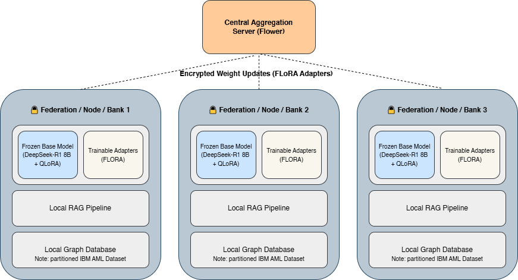

# Thinking Inside the Box

**Efficient Privacy-First Architecture for Distributed Reasoning using Federated Large Language Models**

CSC3094 Dissertation Project - Viacheslav Horbanov, Newcastle University

---

## Overview

Modern Federated Learning (FL) systems face a fundamental **Privacy-Utility-Efficiency Trilemma**: securing data locally tends to degrade model reasoning capability, while transmitting full LLM weights across nodes is prohibitively expensive.

This project proposes a novel architecture that resolves these trade-offs by **decoupling Reasoning from Knowledge**:

- **Reasoning** - lightweight FLoRA adapters trained locally and shared as encrypted weight updates
- **Knowledge** - private transaction data stays local, accessed via an on-device RAG pipeline

The result is a system capable of complex financial fraud detection across a simulated network of banks, with no raw data ever leaving a node.

---

## Architecture



Each federation node (bank) runs:
- A **frozen base model** (DeepSeek-R1 8B + QLoRA, ~6GB VRAM at 4-bit quantization)
- **Trainable FLoRA adapters** - only these are transmitted to the central server
- A **local RAG pipeline** querying private transaction logs
- A **local Kuzu graph database** holding a partition of the IBM AML dataset

The **Central Aggregation Server** aggregates adapter weight updates using FLoRA (stacking + SVD) - never raw data or full model weights.

---

## Key Technologies

| Component | Technology |
|---|---|
| Base Model | DeepSeek-R1-Distill-8B |
| Fine-tuning | QLoRA / FLoRA (Federated Low-Rank Adaptation) |
| Federation | In-process simulation loop with FLoRAStrategy aggregation |
| Local Knowledge Retrieval | RAG (Retrieval-Augmented Generation) |
| Graph Database | Kuzu (embedded, local per node) |
| Dataset | IBM AML (Anti-Money Laundering) - synthetic, open-source |
| Compute | Google Colab (A100, 40GB VRAM) |

---

## Project Structure

```
src/
- config.py                   - central Config dataclass (all hyperparams and paths)
- graph/
  - base.py                   - GraphStore ABC (Strategy pattern interface)
  - kuzu_store.py             - KuzuGraphStore - embedded DB, one .db file per node
  - networkx_store.py         - NetworkXGraphStore - in-memory, for tests
  - neo4j_store.py            - Neo4jGraphStore - stub for real deployment (Phase 4)
  - factory.py                - GraphStoreFactory - creates backend from config
- model/
  - model_loader.py           - load_model(), load_tokenizer(), attach_lora(), decode_output()
- data/
  - aml_ingestor.py           - AMLIngestor - partition by bank ID, 70/15/15 train/val/test split
- pipeline/
  - prompt_builder.py         - pure function, builds LLM prompt from graph context
  - investigation.py          - InvestigationPipeline (Facade)
- federation/
  - client.py                 - AMLFlowerClient - local LoRA training + F1 evaluation per node
  - server.py                 - FLoRAStrategy (stacking + SVD aggregation), start_server()

```

The graph database layer uses the **Strategy pattern** - `GraphStore` is the abstract interface, with `KuzuGraphStore` as the default backend. The federation and RAG layers depend only on the interface, making the backend swappable without touching any other code.

---

## Objectives

1. **Federated Simulation** - Simulate a cross-silo network of banking institutions with realistic non-IID data distributions across nodes
2. **Local RAG** - Enable each node to query its private transaction graph for reasoning, without exposing data externally
3. **Trilemma Evaluation** - Benchmark against baselines across:
   - **Utility** - F1-Score on AML detection
   - **Efficiency** - Communication volume and latency
   - **Privacy** - Resilience to data leakage

---

## Methodology

The project follows a **Simulation-First** approach:

1. Establish a working local RAG + reasoning system on a single node
2. Introduce the Flower federation layer once single-node reasoning is validated
3. Scale to multi-node simulation and run benchmarks

This staged approach decouples the complexity of reasoning from the complexity of federation, reducing risk against hardware and OOM constraints.

---

## References

- McMahan et al. (2017) - Federated Learning
- Zhou et al. (2023) - DualMask: Privacy-Utility-Efficiency Trilemma
- Wang et al. (2024) - FLoRA: Federated Low-Rank Adaptation
- Lewis et al. (2020) - Retrieval-Augmented Generation
- Hu et al. (2022) - LoRA: Low-Rank Adaptation
- DeepSeek-AI (2025) - DeepSeek-R1
- Weber et al. (2018) - IBM AML Dataset
- Beutel et al. (2020) - Flower Framework
