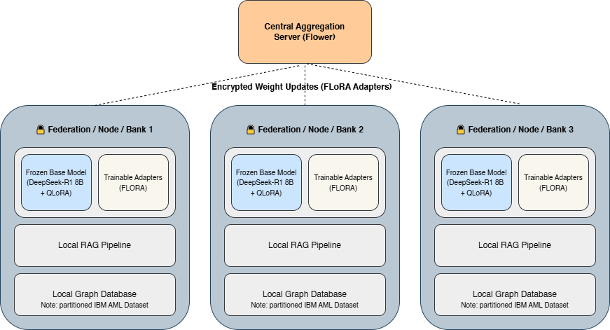

# Thinking Inside the Box

**Efficient Privacy-First Architecture for Distributed Reasoning using Federated Large Language Models**

CSC3094 Dissertation Project - Viacheslav Horbanov, Newcastle University

---

## Overview

Modern Federated Learning (FL) systems face a fundamental **Privacy-Utility-Efficiency Trilemma**: securing data locally tends to degrade model reasoning capability, while transmitting full LLM weights across nodes is prohibitively expensive.

This project proposes a novel architecture that resolves these trade-offs by **decoupling Reasoning from Knowledge**:

- **Reasoning** - lightweight FLoRA adapters trained locally and shared as encrypted weight updates
- **Knowledge** - private transaction data stays local, accessed via an on-device RAG pipeline

The result is a system capable of complex financial fraud detection across a simulated network of banks, with no raw data ever leaving a node.

---

## Architecture



Each federation node (bank) runs:
- A **frozen base model** (DeepSeek-R1 8B + QLoRA, ~6GB VRAM at 4-bit quantization)
- **Trainable FLoRA adapters** - only these are transmitted to the central server
- A **local RAG pipeline** querying private transaction logs
- A **local Kuzu graph database** holding a partition of the IBM AML dataset

The **Central Aggregation Server** aggregates adapter weight updates using FLoRA (stacking + SVD) - never raw data or full model weights.

---

## Key Technologies

| Component | Technology |
|---|---|
| Base Model | DeepSeek-R1-Distill-8B |
| Fine-tuning | QLoRA / FLoRA (Federated Low-Rank Adaptation) |
| Federation | In-process simulation loop with FLoRAStrategy aggregation |
| Local Knowledge Retrieval | RAG (Retrieval-Augmented Generation) |
| Graph Database | Kuzu (embedded, local per node) |
| Dataset | IBM AML (Anti-Money Laundering) - synthetic, open-source |
| Compute | Google Colab (A100, 40GB VRAM) |

---

## Project Structure

```
src/
- config.py                   - central Config dataclass (all hyperparams and paths)
- graph/
  - base.py                   - GraphStore ABC (Strategy pattern interface)
  - kuzu_store.py             - KuzuGraphStore - embedded DB, one .db file per node
  - networkx_store.py         - NetworkXGraphStore - in-memory, for tests
  - neo4j_store.py            - Neo4jGraphStore - stub for real deployment (Phase 4)
  - factory.py                - GraphStoreFactory - creates backend from config
- model/
  - model_loader.py           - load_model(), load_tokenizer(), attach_lora(), decode_output()
- data/
  - aml_ingestor.py           - AMLIngestor - partition by bank ID, 70/15/15 train/val/test split
- pipeline/
  - prompt_builder.py         - pure function, builds LLM prompt from graph context
  - investigation.py          - InvestigationPipeline (Facade)
- federation/
  - client.py                 - AMLFederatedClient - local LoRA training + F1 evaluation per node
  - server.py                 - FLoRAStrategy (stacking + SVD aggregation), start_server()

```

The graph database layer uses the **Strategy pattern** - `GraphStore` is the abstract interface, with `KuzuGraphStore` as the default backend. The federation and RAG layers depend only on the interface, making the backend swappable without touching any other code.

---

## Objectives

1. **Federated Simulation** - Simulate a cross-silo network of banking institutions with realistic non-IID data distributions across nodes
2. **Local RAG** - Enable each node to query its private transaction graph for reasoning, without exposing data externally
3. **Trilemma Evaluation** - Benchmark against baselines across:
   - **Utility** - F1-Score on AML detection
   - **Efficiency** - Communication volume and latency
   - **Privacy** - Membership Inference Attack accuracy against shared adapter updates

---

## Benchmarking

The evaluation benchmarks this architecture against two baselines across all three axes of the Trilemma.

### Baselines

| Baseline | Description |
|---|---|
| **Centralized** | Single model trained on the full merged dataset - upper bound on utility, zero privacy |
| **FedAvg (full weights)** | Standard FedAvg transmitting full model weights - realistic federation cost, no RAG |

The proposed architecture (**FLoRA + RAG**) is expected to match Centralized utility while beating FedAvg on efficiency and both baselines on privacy.

### Metrics

#### Utility - F1-Score

Macro-averaged F1 on the held-out AML test split, reported per federation round to show convergence behaviour.

The dataset is split at the **account level** (not transaction level). Each source account gets a single binary label - `1` if any of its outgoing transactions are flagged as laundering, `0` otherwise. A stratified 70/15/15 train/val/test split is then applied per node, preserving the laundering ratio in each partition. The test set (15%) is never seen during training or federation.

Each node holds only transactions where `From Bank == node_id`, creating a realistic non-IID partition across clients.

- Higher is better
- Target: match or exceed Centralized F1 after N rounds

#### Efficiency - Communication Volume and Round Latency

- **Communication volume** - total megabytes transmitted per round (adapter deltas only vs. full weights). FLoRA transmits `2 * rank * hidden_dim` parameters per layer vs. the full parameter count for FedAvg.
- **Round latency** - wall-clock time per federation round, measured inside the simulation loop.

Both are logged per round and compared across all three configurations.

#### Privacy - Membership Inference Attack Accuracy

A Membership Inference Attack (MIA) is run against the adapter weight updates transmitted to the aggregation server. The attacker is given the delta tensors from one round and attempts to classify whether a specific transaction record was in that node's training partition.

- Measured as **attack accuracy** (0.5 = random chance = perfect privacy, 1.0 = full leakage)
- The architecture's privacy claim holds if MIA accuracy stays near 0.5, confirming the adapter deltas carry negligible membership signal
- Compared against a centralized model where the attacker has access to the full model - expected to yield significantly higher MIA accuracy

### Summary Table

| Metric | Centralized | FedAvg (full) | FLoRA + RAG (ours) |
|---|---|---|---|
| F1-Score | upper bound | degraded (non-IID) | target: matches Centralized |
| Comm. Volume / round | N/A | full model size | adapter deltas only (~1% of model) |
| MIA Accuracy | high (data exposed) | moderate | target: near 0.5 (random) |

---

## Methodology

The project follows a **Simulation-First** approach:

1. Establish a working local RAG + reasoning system on a single node
2. Introduce the Flower federation layer once single-node reasoning is validated
3. Scale to multi-node simulation and run benchmarks

This staged approach decouples the complexity of reasoning from the complexity of federation, reducing risk against hardware and OOM constraints.

---

## References

- McMahan et al. (2017) - Federated Learning
- Zhou et al. (2023) - DualMask: Privacy-Utility-Efficiency Trilemma
- Wang et al. (2024) - FLoRA: Federated Low-Rank Adaptation
- Lewis et al. (2020) - Retrieval-Augmented Generation
- Hu et al. (2022) - LoRA: Low-Rank Adaptation
- DeepSeek-AI (2025) - DeepSeek-R1
- Weber et al. (2018) - IBM AML Dataset
- Beutel et al. (2020) - Flower Framework
